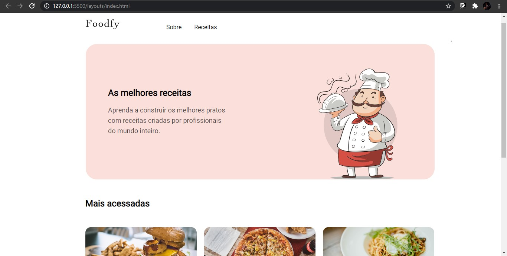

# Site Foodfy 

<h1 align=center>

</h1>

## 📜 Sobre
Site desenvolvido no segundo módulo do **Bootcamp LaunchBase** da [Rocketseat](https://rocketseat.com.br/).

Página inicial 👆🏼

## ⚡ Tecnologias Utilizadas

- HTML
- CSS
- JavaScript

## 📝 Licença
Esse projeto está sob a licença MIT. Veja o arquivo [LICENSE](LICENSE) para mais detalhes.